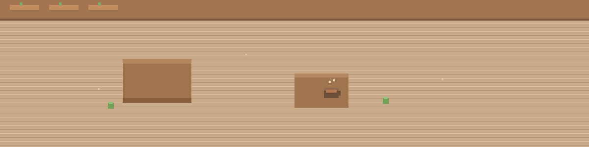

<!-- Banner (replace the image URL with your banner file in the repo) -->

> “First I drink the coffee. Then I do the things.” — a motto for calm productivity
> ---

- 🔍 Open-minded, ever willing to learn!  
- 📚 Current status: Student (Tkps'22, Bgss'27, ❔)
- 🌱 I like slow mornings, plants, and coffee-shop coding sessions.
- CTF player! (24/11/2025)

---
[%E1%B6%BB%F0%9D%97%93%F0%90%B0%81)](https://git.io/typing-svg)
- STILL IN CONSTRUCITON
- (portfolio website still at work!)

---

 - [Github](https://github.com/GlitchedParadox)
